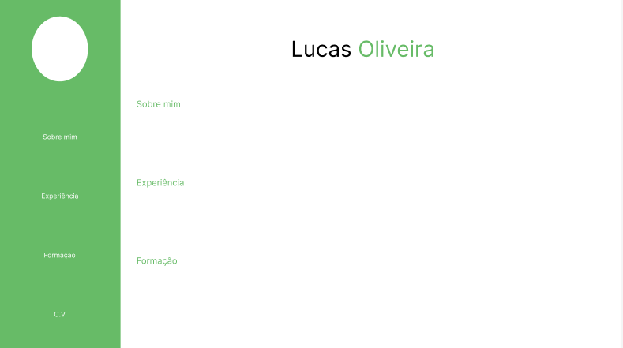

# Portfólio Lucas Silva de Oliveira

Portfólio criado para a disciplina de Desenvolvimento Web do curso de Sistemas de Informação do Instituto Federal de Educação, Ciência e Tecnologia Baiano.


## **Estrutura da Página**

A página foi inicialmente planejada com base em um protótipo, que pode ser visualizado abaixo:


A estrutura da página é dividida em duas áreas principais: à esquerda, um menu de navegação com links para as diferentes seções; à direita, o conteúdo correspondente a essas seções. O desenvolvimento seguiu a abordagem mobile first, priorizando a otimização para dispositivos móveis antes de ajustar o design para tablets, desktops e televisores, assegurando assim a responsividade em todas as telas.

O primeiro passo no desenvolvimento foi a definição das **propriedades globais do nosso projeto.**

```css
@import url('https://fonts.googleapis.com/css2?family=Josefin+Sans:ital,wght@0,100..700;1,100..700&display=swap');

* {
    font-family: "Josefin Sans", sans-serif;
    box-sizing: border-box;
}

```

• Aqui estão as **as variáveis globais** da página.
```css
:root {
    --cor-background: #FFFFFF;
    --cor-primaria: #67BB67;
    --cor-destaque: #3A606E;
    --cor-destaque1: #5E4C5A;
    --fonte-tamanho-h1: 2.4em;
    --fonte-tamanho-h2: 2em;
    --fonte-tamanho-h3: 1.6em;
    --fonte-tamanho-h4: 1.3em;
    --fonte-tamanho-p: 1em;
    --fonte-tamanho-pg: 1.1em;
    --fonte-tamanho-g: 1.2em;
}

body, html {
    margin: 0;
    padding: 0;
    width: 100dvw;
    height: 100dvh;
    background-color: var(--cor-background);
    color: black;
}
h1 {
    color: var(--cor-destaque);
    font-size: var(--fonte-tamanho-h1);
}
h2 {
    font-size: var(--fonte-tamanho-h2);
    color: var(--cor-primaria);
}

h3 {
    font-size: var(--fonte-tamanho-h3);
    color: var(--cor-primaria);
}

h4 {
    font-size: var(--fonte-tamanho-h4);
    color: var(--cor-destaque);
}

p {
    font-size: var(--fonte-tamanho-p);
    text-align: justify;
}

span {
    font-weight: 300;
}
header {
    background-color: var(--cor-primaria);
}

```

• Em seguida, definimos o contêiner que abrigará o menu de navegação e o conteúdo da página. Como seguimos a abordagem **mobile first**, o menu **não será exibido** em telas com dimensões típicas de smartphones.


```css

.container {
    display: flex;
    width: 100%;
    margin: 0;
    padding: 0;
    box-sizing: border-box;
}

.menu {
    display: none;
}

.content {
    display: flex;
    flex-direction: column;
    align-items: center;
    width: 80%;
    margin-left: 10%;
    box-sizing: border-box;
    align-items: center;
    margin-right: 10%;
    padding: 1rem;
    
}
```

• Com o **menu**, ficará da seguinte forma:

```css
.menu {
    position: fixed;
    top: 0;
    left: 0;
    width: 20%;
    height: 100%;
    background-color: var(--cor-primaria);
    display: flex;
    flex-direction: column;
    align-items: center; 
    justify-content: space-evenly;
    box-sizing: border-box;
    padding: 2rem 0;
}
    
.sidebar {
    display: flex;
    flex-direction: column;
    align-items: center;
    justify-content: space-around;
    width: 100%;
    position: relative;
    height: 100%;
}

```
**A página é divida nas seguintes seções:** 

- **Home:** Uma breve apresentação sobre mim.

- **Sobre:** Um texto falando um pouco sobre mim e as tecnologias que já utilizei.

- **Experiência:** Experiências no geral.

- **Formação:** Formação acadêmica e notas.

- **Contato:** Links para encontrar meus projetos e/ou comunicar-se comigo.


• Como estou utilizando a abordagem mobile first, a media query é responsável por ajustar o layout para **tamanhos de tablet.**


```css
media (min-width: 768px)  {
    p {
        font-size: var(--fonte-tamanho-pg);
    } 
    .menu {
        position: fixed;
        top: 0;
        left: 0;
        width: 20%;
        height: 100%;
        background-color: var(--cor-primaria);
        display: flex;
        flex-direction: column;
        align-items: center; 
        justify-content: space-evenly;
        box-sizing: border-box;
        padding: 2rem 0;
    }
    
    .sidebar {
        display: flex;
        flex-direction: column;
        align-items: center;
        justify-content: space-around;
        width: 100%;
        position: relative;
        height: 100%;
    }
    
    .sidebar ul {
        display: flex;
        flex-direction: column;
        justify-content: space-around;
        padding: 0;
        margin: 0;
    }

    .sidebar li {
        width: 100%;
        text-align: center;
        margin: 1rem 0;
        
    }
    
    .sidebar li a {
        display: block;
        text-align: center; 
        padding:1rem 0; 
        text-decoration: none;
        color: white;
        width: 100%;
        font-size: calc(.1em + 1vw);
    }

    .sidebar li a:hover {
        color:var(--cor-destaque);
    }
    
    .foto-perfil {
        width: 14vw;
        height: 14vw; 
        border-radius: 50%; 
        margin-bottom: 1rem; 
        padding: 0;
        object-fit: cover;
        max-width: 150px;
        max-height: 150px;
    }

    
    .conteudo {
        flex: 1;
        margin-left: 20%;
        box-sizing: border-box;
        align-items: center;
        padding: 1rem;
    }

    
    a img {
        width: 6vw;
        height: 6vh;
    }
}
```

• Para resoluções com **largura miníma de 1028px**.

```css
@media (min-width : 1024px) {
    p {
        font-size: var(--fonte-tamanho-g);
    } 
    

    a img {
        width: 5vw;
        height: 5vh;
    }
}

```

## Conclusão

Este é o meu portfólio. Nele, você encontrará informações sobre quem sou, meus objetivos, conhecimentos adquiridos, interesses, experiência e detalhes para contato.

## Dados do Autor
• **Nome:** Lucas Silva de Oliveira

• **Faculdade:** Instituto Federal de Educação, Ciência e Tecnologia Baiano - Campus Itapetinga

• **Email:** 20211ITA01GB0001@alunos.ifbaiano.edu.br

• **Matrícula:** 20211ITA01GB0001